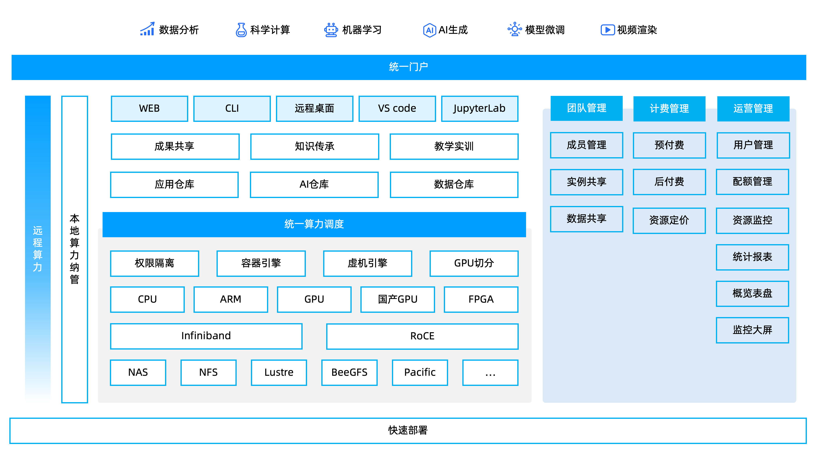
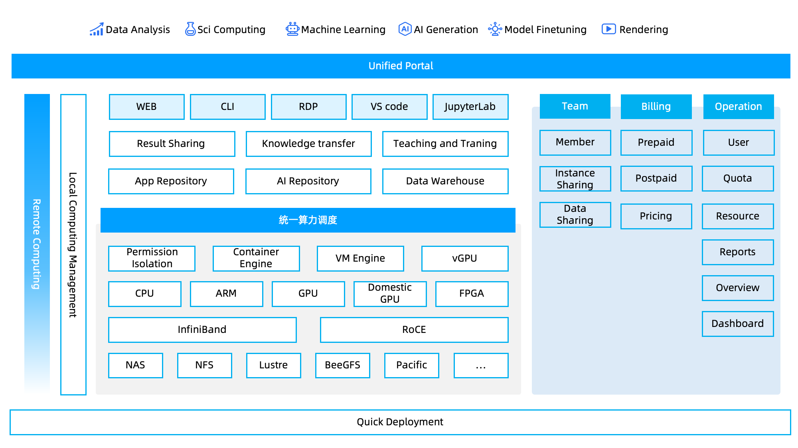

# Mini EaaS (Lightweight AI Cloud Platform)

[English Version](#mini-eaas---lightweight-ai-computing-platform) | [中文版本](#mini-eaas---轻量化人工智能云平台)

---

# Mini EaaS - 轻量化人工智能云平台

  
  
  
   
  <b>小规模，大能量 —— 专为成长型团队打造的 AI 基础设施管理系统</b>

## 📖 项目简介 (Introduction)

**Mini EaaS** 是 [联旌智能科技（上海）有限公司](https://liankin.com) 推出的轻量化人工智能私有云平台。它摒弃了传统算力调度软件复杂的部署与维护流程，专为 **0-8 节点** 的中小规模 AI 集群设计。

通过全自动化部署脚本和可视化 Web 界面，Mini EaaS 帮助科研实验室、AI 初创团队及个人开发者将分散的 GPU 服务器（NVIDIA 或国产异构芯片）统一纳管，构建私有算力池。同时，独创的 **“混合云”** 架构允许用户一键调用远程弹性算力，解决本地资源不足的痛点。

> **核心承诺**：0-2 个计算节点 **永久免费**，功能无阉割。

## ✨ 核心特性 (Key Features)

*   **🚀 轻量化极速交付**
    *   **低运维门槛**：告别复杂的 Linux 底层配置与集群规划。
    *   **自动化部署**：通过向导式脚本，**30分钟内** 即可在普通 PC、NAS 或单台服务器上完成全套平台搭建。

*   **⚙️ 容器与虚机双引擎**
    *   **全场景覆盖**：同时支持 **容器 (Container)** 与 **虚拟机 (VM)** 两种调度模式。
    *   **灵活选择**：用容器运行轻量级 AI 训练/推理任务，用虚拟机运行持久化的开发环境或传统应用。

*   **⚡️ 显卡切分与精细化调度**
    *   **资源利用率 Max**：支持 vGPU/MIG 切分技术，将一张物理显卡切分给多位开发者同时使用，显存与算力严格隔离。
    *   **专注单机效能**：摒弃复杂的跨节点并行（MPI）调度，专注于 **单机多卡** 与 **单机单卡** 的极致效率与稳定性。

*   **🧩 异构硬件统一纳管**
    *   **不挑硬件**：兼容 NVIDIA 全系列 GPU 及主流 **国产 AI 芯片**。
    *   **混合组网**：支持 x86 与 ARM 架构服务器在同一平台下统一管理。

*   **☁️ 内置混合云弹性算力**
    *   **无限扩展**：本地算力不足？无需购买昂贵硬件，点击按钮即可一键扩展高性价比的 **远程云端算力**，按需付费。

*   **🛠 开箱即用的 AI 工作台**
    *   **应用商店**：内置 TensorFlow, PyTorch 等主流镜像，一键拉起 **JupyterLab**、**VS Code** 等交互式开发环境。
    *   **所见即所得**：提供可视化的资源监控与环境管理，无需学习复杂的命令行操作。

## 🏗️ 架构概览 (Architecture)

## 🚀 快速开始 (Getting Started)

### 1. 环境要求

管理节点：X86，8 core CPU, 64GB RAM, 1T Disk, 千兆或以上网口2个

注：ARM架构的管理节点，请等待后续版本支持。

### 2. 获取镜像

扫描下方二维码，填写信息，获取镜像下载链接。

### 3. 制作启动U盘并安装

准备一个U盘，使用Rufus工具将Mini EaaS镜像制作成启动U盘。将 U 盘插入管理节点，并设置管理节点从 U 盘启动。

根据提示完成配置和安装。

### 4. 访问控制台

安装完成后，脚本将输出访问地址。

默认管理端地址为：
`http://<管理节点IP>:8080`

默认用户端地址为：
`http://<管理节点IP>:80`

### 5. 注册计算节点

设置从网络启动计算节点，自动完成注册。

## 💰 版本体系 (Editions)

| 版本 | 节点数量 | 授权费用 | 适用场景 |
| :--- | :--- | :--- | :--- |
| **免费版** | **0 - 2 节点** | **永久免费** | 个人开发者、学生、微型实验室 |
| **入门版** | 3 - 5 节点 | 付费授权 | 初创工作室 |
| **进阶版** | 6 - 8 节点 | 付费授权 | 成长型企业、重度研发团队 |

*注：
    1. 所有版本均支持“内置远程算力”功能。
    2. 只有入门版和进阶版支持购买技术服务。*

## 📚 文档与支持 (Support)

*   **社区论坛**: [hpc.cloud](https://hpc.cloud/t/mini-eaas)
*   **问题反馈**: 请在 [Issues](../../issues) 中提交 Bug 或功能建议。
*   **商业合作**: 联系 `htlu#clustertech.com` 或拨打 `400-038-6608`。

---

 

---

# Mini EaaS - Lightweight AI Computing Platform

  
  
   
  <b>Small Scale, Big Energy. The AI Infrastructure OS for Growing Teams.</b>

## 📖 Introduction

**Mini EaaS** is a lightweight, private AI cloud platform developed by [Liankin](https://liankin.com). Designed specifically for small-to-medium clusters ranging from **0 to 8 nodes**, it eliminates the complexity of traditional cloud management software deployment.

With fully automated deployment scripts and a visualized Web UI, Mini EaaS helps research labs, AI startups, and individual developers manage fragmented GPU servers (NVIDIA or Heterogeneous chips) into a unified private compute pool. Its unique **Hybrid Cloud** architecture allows seamless bursting to remote elastic compute resources when local capacity is insufficient.

> **Our Promise**: 0-2 Compute Nodes are **Free Forever** with full features.

## ✨ Key Features

*   **🚀 Lightweight Rapid Deployment**
    *   **Low Ops**: Say goodbye to complex Linux configurations and cluster planning.
    *   **Automated Setup**: Deploy the entire platform on a PC, NAS, or single server in under **30 minutes** via wizard-style scripts.

*   **⚙️ Dual Engine: Container & VM**
    *   **Full Coverage**: Supports scheduling for both **Containers** (for lightweight AI training/inference) and **Virtual Machines** (for persistent dev environments).
    *   **Flexible Choice**: Choose the right runtime for your specific workload needs.

*   **⚡️ GPU Slicing & Fine-Grained Scheduling**
    *   **Maximize Utilization**: Supports **vGPU/MIG** technology to slice a single physical GPU into multiple isolated instances for simultaneous use by multiple users.
    *   **Single-Node Efficiency**: Focuses on optimizing **Single-Node Multi-Card** performance and stability, removing the complexity of cross-node MPI scheduling.

*   **🧩 Heterogeneous Hardware Management**
    *   **Hardware Agnostic**: Compatible with NVIDIA GPUs and mainstream **Domestic AI Chips**.
    *   **Hybrid Architecture**: Supports unified management of x86 and ARM servers within the same platform.

*   **☁️ Built-in Hybrid Cloud Bursting**
    *   **Infinite Elasticity**: Running out of local VRAM? Instantly scale out to high-performance **Remote Cloud GPUs** with a single click. Pay only for what you use.

*   **🛠 Out-of-the-Box AI Workbench**
    *   **App Store**: Built-in images for TensorFlow, PyTorch, etc. Launch interactive environments like **JupyterLab** and **VS Code** in one click.
    *   **Visualized Experience**: Provides real-time resource monitoring and environment management via a Web UI—no CLI expertise required.

## 🏗️ Architecture

## 🚀 Getting Started

### 1. Prerequisites

**Master Node**: X86 arch, 8 Core CPU, 64GB RAM, 1T Disk, 2x 1GE network ports or above.

Note: ARM architecture for the Master Node will be supported in future versions.

### 2. Get Image

Fill in the [google form](https://forms.gle/qtvvZkU33f6amxmi9) to get the download link.

### 3. Create Bootable USB and Install

Prepare a USB drive and use Rufus to create a bootable USB with the Mini EaaS image. Insert the USB drive into the Master Node and set it to boot from the USB.

Follow the prompts to complete the configuration and installation.

### 4. Access Console

After installation, the script will output the access address.

Default Management Console address:
`http://<Master-IP>:8080`

Default User Console address:
`http://<Master-IP>:80`

### 5. Register Compute Nodes

Set the compute nodes to boot from the network to automatically complete registration.

## 💰 Editions & Pricing

| Edition | Node Limit | License Fee | Best For |
| :--- | :--- | :--- | :--- |
| **Free** | **0 - 2 Nodes** | **Free Forever** | Individual Developers, Students, Micro Labs |
| **Starter** | 3 - 5 Nodes | Paid License | Startups |
| **Advanced** | 6 - 8 Nodes | Paid License | Growing Enterprises, Heavy R&D |

*Note: 

1. All editions support the "Remote Hybrid Compute" feature.
2. The service package purchase is only available for Starter and Advanced editions.*

## 📚 Documentation & Support

*   **Community**: [Discussions](https://hpc.cloud/t/mini-eaas)
*   **Bug Report**: Please submit via [Issues](../../issues).
*   **Business Contact**: Email `htlu#clustertech.com` .

---
**Copyright © 2026 Liankin Intelligence. All Rights Reserved.**